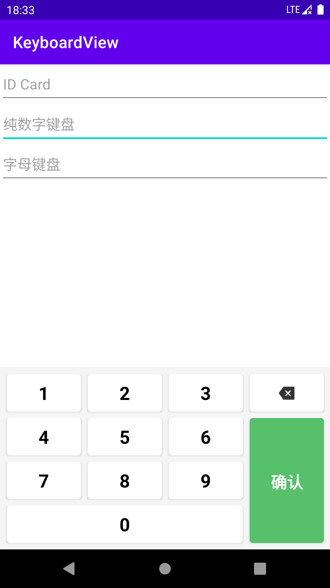
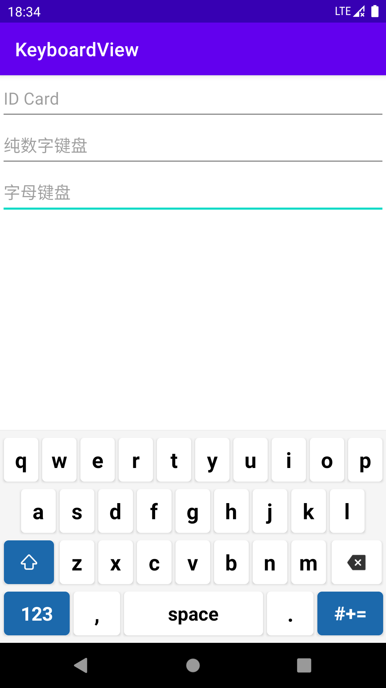
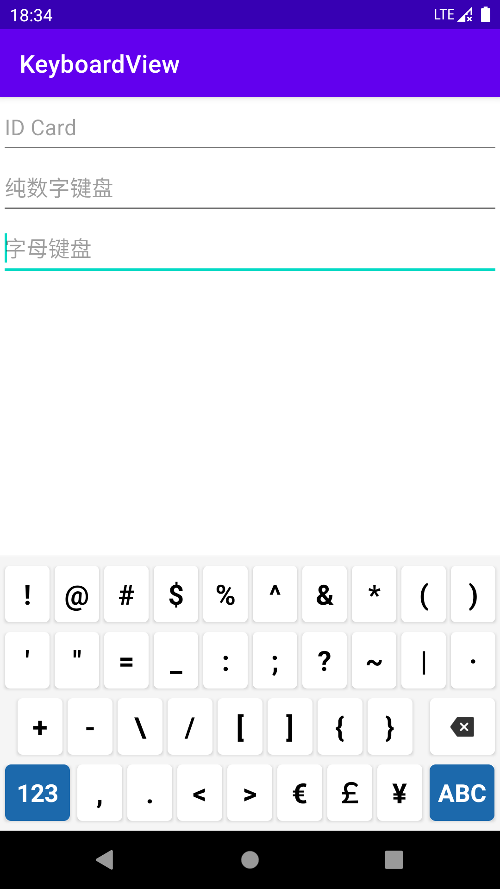

# KeyboardView

Android自定义键盘，在不方便使用其它输入法的情况下（比如输入身份证和银行卡号时，大家应该都知道为什么）可以使用sdk提供的KeyboardView来自定义我们的键盘。

```
@deprecated This class is deprecated because this is just a convenient UI widget class that application developers can re-implement on top of existing public APIs.  If you have already depended on this class, consider copying the implementation from AOSP into your project or re-implementing a similar widget by yourselves
```

由于系统提供的SDK被废弃，让我们自己复制`Keyboard.java`和`KeyboardView.java`到自己的项目里面，因此挪了出来，并进行了一些细微的删减和改动。

此项目同时在开源项目[https://github.com/SValence/SafeKeyboard](https://github.com/SValence/SafeKeyboard)的基础上根据自身需要做了部分删减和改动，感谢作者[SValence](https://github.com/SValence)






